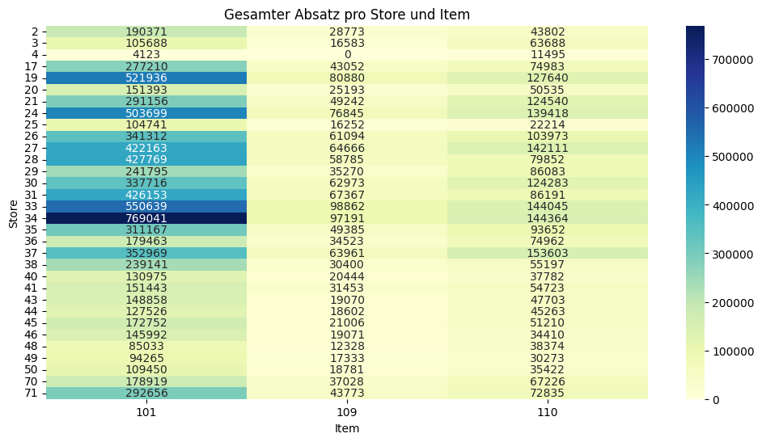
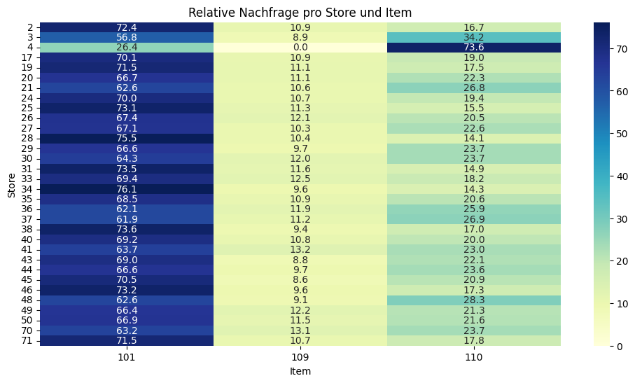
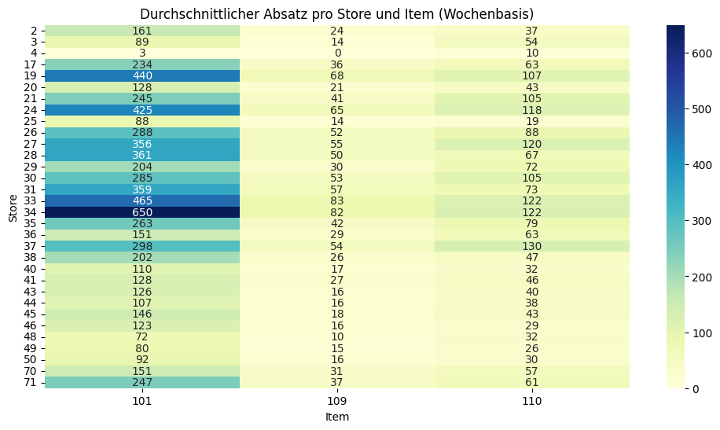

# **Data Preprocessing for Bakery Dataset**

Diese Seite dokumentiert die **daten­satz­spezifische** Analyse und Aufbereitung für den *Bakery*-Datensatz.

### **1. Datenerhebung** 

Die Daten wurden vom Lehrstuhl für Logistik und Supply Chain bereitgestellt.

### **2. Datenüberblick & Beschreibung**

- Es handelt sich um Daten einer Bäckereikette mit mehreren Filialen.
- Der Datensatz enthält **interne** (z. B. Promotionen, Nachfrage) und **externe** (z. B. Wetter, Feiertage) Informationen.
- Zu beachten ist, dass viele der unten aufgeführten Spalten bereits vorverarbeitet sind, sodass einige Beispiele bereits skaliert oder kodiert wurden.
- Die Spalte „Ursprung“ gibt an, ob eine Variable bereits im ursprünglichen Datensatz des Lehrstuhls enthalten war oder ob sie im Rahmen der Vorverarbeitung von mir ergänzt bzw. konstruiert wurde:
    - original: Die Variable war bereits im Ausgangsdatensatz enthalten und wurde ggf. bereinigt oder korrigiert.
    - abgeleitet: Die Variable wurde von mir neu erzeugt – entweder durch Transformation bestehender Spalten oder durch Kombination bzw. Berechnung zusätzlicher Merkmale (Feature Engineering).

??? info "Datensatz Bescheibung"
    | Variable                                           | Datentyp | Beispiel    | Ursprung   | Transformation                            | Beschreibung                                           |
    | -------------------------------------------------- | -------: | ----------- | ---------- | ----------------------------------------- | ------------------------------------------------------ |
    | date                                               | datetime | 2016-01-30  | original   | none                                      | Kalendertag (ISO-Datum).                               |
    | is\_schoolholiday                                  |      int | 0           | original   | binary encoded                            | Schulferien: 1 = ja, 0 = nein.                         |
    | is\_holiday                                        |      int | 0           | original   | binary encoded                            | Gesetzlicher Feiertag: 1 = ja, 0 = nein.               |
    | is\_holiday\_next2days                             |      int | 0           | original   | binary encoded                            | In den nächsten 2 Tagen liegt mind. ein Feiertag: 1/0. |
    | rain                                               |    float | 9.40        | original   | none                                      | Niederschlag (mm) am Tag.                              |
    | temperature                                        |    float | 6.70        | original   | none                                      | Tagesmittel-Temperatur (°C).                           |
    | promotion\_currentweek                             |      int | 0           | original   | binary encoded                            | Promotion in der aktuellen Woche: 1/0.                 |
    | promotion\_lastweek                                |      int | 0           | original   | binary encoded                            | Promotion in der Vorwoche: 1/0.                        |
    | weekday                                            |      int | 5           | abgeleitet | aus `date`                                | 0 = Mo, …, 6 = So.                                     |
    | month                                              |      int | 1           | abgeleitet | aus `date`                                | Monat 1–12 (Jan–Dez).                                  |
    | year                                               |      int | 2016        | abgeleitet | aus `date`                                | Kalenderjahr.                                          |
    | label                                              |   object | train       | original   | none                                      | Kennzeichnung Train/Test.                              |
    | dayIndex                                           |    float | 30.0        | abgeleitet | aus `date`                                | Laufender Tagesindex (Start = erster Datentag).        |
    | scalingValue                                       |    float | 789.0       | original   | none                                      | Maximalwert der Nachfrage je ID (für Skalierung).      |
    | demand\_\_sum\_values\_X                           |    float | 2163498.0   | abgeleitet | Rolling-Summe (X∈{7,14,28}), **scaled**   | Summe von `demand` über X Tage.                        |
    | demand\_\_median\_X                                |    float | 0.285171    | abgeleitet | Rolling-Median (X∈{7,14,28}), **scaled**  | Median der Nachfrage über X Tage.                      |
    | demand\_\_mean\_X                                  |    float | 0.309071    | abgeleitet | Rolling-Mean (X∈{7,14,28}), **scaled**    | Gleitender Mittelwert über X Tage.                     |
    | demand\_\_standard\_deviation\_X                   |    float | 0.109834    | abgeleitet | Rolling-Std (X∈{7,14,28}), **scaled**     | Std.-Abw. über X Tage.                                 |
    | demand\_\_variance\_X                              |    float | 0.012064    | abgeleitet | Rolling-Var (X∈{7,14,28}), **scaled**     | Varianz über X Tage.                                   |
    | demand\_\_root\_mean\_square\_X                    |    float | 0.328007    | abgeleitet | Rolling-RMS (X∈{7,14,28}), **scaled**     | RMS der Nachfrage über X Tage.                         |
    | demand\_\_maximum\_X                               |    float | 0.558935    | abgeleitet | Rolling-Max (X∈{7,14,28}), **scaled**     | Maximalwert über X Tage.                               |
    | demand\_\_absolute\_maximum\_X                     |    float | 0.558935    | abgeleitet | Rolling-Abs-Max (X∈{7,14,28}), **scaled** | Absolutes Maximum über X Tage.                         |
    | demand\_\_minimum\_X                               |    float | 0.21673     | abgeleitet | Rolling-Min (X∈{7,14,28}), **scaled**     | Minimalwert über X Tage.                               |
    | demand                                             |    float | 0.69455     | abgeleitet | skaliert mit `scalingValue`               | Zielvariable (skaliert).                               |
    | id                                                 |   object | 17.0\_101.0 | original   | none                                      | Schlüssel: `store_id`\_`item_id`.                      |
    | item\_X                                            |      int | 1           | abgeleitet | One-Hot (z. B. 101, 109, 110)             | One-Hot-Kodierung der Produkt-ID.                      |
    | store\_X                                           |      int | 1           | abgeleitet | One-Hot (mehrere Stores)                  | One-Hot-Kodierung der Store-ID.                        |
    | demand\_original\_reconstructed                    |    float | 548.0       | abgeleitet | `demand * scalingValue`                   | Rekonstruierter unge­skalierter Nachfragewert.         |
    | yearMonth                                          |   object | 2016-01     | abgeleitet | zeitl. Aggregation (Monat)                | YYYY-MM für Visualisierung/Grouping.                   |
    | yearWeek                                           |   object | 2016-04     | abgeleitet | zeitl. Aggregation (ISO-Woche)            | YYYY-WW (ISO-Woche) für Visualisierung/Grouping.       |
    | store\_id                                          |      int | 17          | abgeleitet | aus `id`                                  | Numerische Store-ID.                                   |
    | item\_id                                           |      int | 101         | abgeleitet | aus `id`                                  | Numerische Item-ID.                                    |
    | week                                               |      int | 4           | abgeleitet | aus `date`                                | ISO-Kalenderwoche (1–53).                              |
    | year\_scaled                                       |      int | 0           | abgeleitet | Min-Shift (2016→0, 2017→1, …)             | Jahr auf 0-basierte Skala verschoben.                  |
    | dayofyear                                          |      int | 30          | abgeleitet | aus `date`                                | Tag im Jahr (1–365/366).                               |
    | dayofyear\_sin                                     |    float | 0.493776    | abgeleitet | zyklisch (sin)                            | Zyklische Kodierung von `dayofyear`.                   |
    | dayofyear\_cos                                     |    float | 0.869589    | abgeleitet | zyklisch (cos)                            | Zyklische Kodierung von `dayofyear`.                   |
    | weekday\_sin                                       |    float | −0.974928   | abgeleitet | zyklisch (sin)                            | Zyklische Kodierung von `weekday`.                     |
    | weekday\_cos                                       |    float | −0.222521   | abgeleitet | zyklisch (cos)                            | Zyklische Kodierung von `weekday`.                     |
    | month\_sin                                         |    float | 0.5         | abgeleitet | zyklisch (sin)                            | Zyklische Kodierung von `month`.                       |
    | month\_cos                                         |    float | 0.866025    | abgeleitet | zyklisch (cos)                            | Zyklische Kodierung von `month`.                       |
    | demand\_lag\_X                                     |    float | 0.26109     | abgeleitet | Lag X∈{1,7,14,28}                         | Nachfragewert vor X Tagen.                             |
    | demand\_lag\_X\_was\_nan                           |      int | 1           | abgeleitet | binary encoded                            | 1, falls ursprünglicher Lag fehlte/ersetzt wurde.      |
    | demand\_diff\_X                                    |    float | −0.001267   | abgeleitet | Diff zu Lag X∈{1,7,14,28}                 | `demand - demand_lag_X`.                               |
    | demand\_diff\_X\_was\_nan                          |      int | 1           | abgeleitet | binary encoded                            | 1, falls ursprüngliche Diff-Basis fehlte.              |
    | demand\_rolling\_mean\_7                           |    float | 0.69455     | abgeleitet | glättend                                  | 7-Tage-Mittel (pro Item/Store).                        |
    | demand\_ratio\_to\_7\_avg                          |    float | 0.999986    | abgeleitet | normierend                                | Verhältnis `demand / rolling_mean_7`.                  |
    | demand\_rolling\_mean\_28                          |    float | 0.69455     | abgeleitet | glättend                                  | 28-Tage-Mittel (pro Item/Store).                       |
    | demand\_ratio\_to\_28\_avg                         |    float | 0.999986    | abgeleitet | normierend                                | Verhältnis `demand / rolling_mean_28`.                 |
    | demand\_rolling\_mean\_7\_lag\_Y                   |    float | 0.69455     | abgeleitet | Lag Y∈{1,7}                               | Verzögerte 7-Tage-Mittelwerte.                         |
    | demand\_rolling\_mean\_7\_lag\_Y\_was\_nan         |      int | 0/1         | abgeleitet | binary encoded                            | 1, falls Wert imputiert wurde.                         |
    | demand\_rolling\_mean\_28\_lag\_Y                  |    float | 0.69455     | abgeleitet | Lag Y∈{1,7}                               | Verzögerte 28-Tage-Mittelwerte.                        |
    | demand\_rolling\_mean\_28\_lag\_Y\_was\_nan        |      int | 0/1         | abgeleitet | binary encoded                            | 1, falls Wert imputiert wurde.                         |
    | demand\_ratio\_to\_7\_avg\_lag\_Y                  |    float | 1.01        | abgeleitet | Lag Y∈{1,7}                               | Verzögertes Verhältnis zu 7-Tage-Mittel.               |
    | demand\_ratio\_to\_7\_avg\_lag\_Y\_was\_nan        |      int | 0/1         | abgeleitet | binary encoded                            | 1, falls Wert imputiert wurde.                         |
    | demand\_ratio\_to\_28\_avg\_lag\_Y                 |    float | 0.98        | abgeleitet | Lag Y∈{1,7}                               | Verzögertes Verhältnis zu 28-Tage-Mittel.              |
    | demand\_ratio\_to\_28\_avg\_lag\_Y\_was\_nan       |      int | 0/1         | abgeleitet | binary encoded                            | 1, falls Wert imputiert wurde.                         |
    | demand\_\_standard\_deviation\_X\_lag\_Y           |    float | 0.11        | abgeleitet | Rolling-Std (X∈{7,14,28}) mit Lag Y∈{1,7} | Verzögerte Std.-Abw. der Nachfragefenster.             |
    | demand\_\_standard\_deviation\_X\_lag\_Y\_was\_nan |      int | 0/1         | abgeleitet | binary encoded                            | 1, falls Wert imputiert wurde.                         |
    | demand\_\_maximum\_X\_lag\_Y                       |    float | 0.56        | abgeleitet | Rolling-Max (X∈{7,14,28}) mit Lag Y∈{1,7} | Verzögerte Maxima der Nachfragefenster.                |
    | demand\_\_maximum\_X\_lag\_Y\_was\_nan             |      int | 0/1         | abgeleitet | binary encoded                            | 1, falls Wert imputiert wurde.                         |
    | rain\_lag\_Z                                       |    float | 8.2         | abgeleitet | Lag Z∈{1,7}                               | Niederschlag vor Z Tagen.                              |
    | rain\_lag\_Z\_was\_nan                             |      int | 0/1         | abgeleitet | binary encoded                            | 1, falls Niederschlags-Lag imputiert wurde.            |
    | temperature\_lag\_Z                                |    float | 5.6         | abgeleitet | Lag Z∈{1,7}                               | Temperatur vor Z Tagen.                                |
    | temperature\_lag\_Z\_was\_nan                      |      int | 0/1         | abgeleitet | binary encoded                            | 1, falls Temperatur-Lag imputiert wurde.               |

    Hinweise & Konventionen:  
    
    - Platzhalter: X steht für Fenstergrößen {7, 14, 28}; Y für Lags {1, 7}; Z für Lags {1, 7}.  
    - Skalierung: Alle mit scaled markierten Demand-Aggregationen beziehen sich auf die skalierten demand-Werte (Skalierung per scalingValue).  
    - One-Hot-Spalten: item_101, item_109, … sowie store_17, store_19, … sind binäre Dummy-Variablen (0/1).  
    - _was_nan-Flags: Markieren, dass das korrespondierende Feature ursprünglich fehlte (z. B. durch Start-Fensterrand) und durch Imputation/Lag-Shift entstand.  

??? warning "Inkonsistenz bei scalingValue"

    Die Spalte `scalingValue` wurde pro Produkt-Store-Kombination (`id`) als **Maximalwert der ursprünglichen Nachfrage** (`demand_original_reconstructed`) berechnet.

    Die ursprünglichen Nachfragewerte wurden anschließend durch Division durch den jeweiligen `scalingValue` normalisiert, sodass die skalierte Spalte `demand` Werte im Bereich von 0 bis 2,15 annimmt.
    Es sei jedoch angemerkt, dass dies nicht in allen Fällen zutrifft: In vier Fällen entspricht der Wert von `scalingValue` **nicht** exakt dem tatsächlichen Maximalwert von `demand_original_reconstructed`, vermutlich wegen Rundungsfehlern bei der Speicherung!


### **3. Data Cleaning** 
In diesem Schritt wurde der Datensatz auf fehlende Werte, Duplikate, Inkonsistenzen und Ausreißer untersucht und bei Bedarf bereinigt.

- Im Originaldatensatz wurden keine fehlenden Werte gefunden.
- Es wurden keine doppelten Zeilen festgestellt.
- Es traten keine Inkonsistenzen in den Variablenformaten oder -werten auf.
- Ausreißer wurden mithilfe von Boxplots für alle relevanten numerischen Variablen geprüft. Hinweis: Viele dieser Variablen sind bereits skaliert, was den sichtbaren Wertebereich der Ausreißer beeinflusst.

<!--
!!! info "Boxplots"

    ```plotly
    {"file_path": "assets/json/bakery/boxplot_multiple.json"}
    ```
-->

### **4. Exploratory Data Analysis (EDA)**

#### Zeitreihenanaylse der Nachfrage
Visualisierung der Nachfrageentwicklung auf unterschiedlichen zeitlichen Aggregationsebenen (z. B. täglich, wöchentlich, pro Store oder Item).

!!! info "Total Demand = Tägliche Gesamtnachfrage"
    === "Per Day"
        ```plotly
            {"file_path": "./assets/json/bakery/totalDemand/total_demand_day.json"}
        ```

        Die **IQR-Methode** (Interquartilsabstand) identifiziert Ausreißer als Werte, die außerhalb des Bereichs von

        * $Q1 − 1.5 × IQR$
        * $Q3 + 1.5 × IQR$

        liegen. Wobei $Q1$ das erste Quartil, $Q3$ das dritte Quartil und $IQR = Q3 − Q1$ der Interquartilsabstand ist.

        Alle Ausreißer mit Nachfrage = 0 sind Feiertage.

    === "Per Week"
        ```plotly
        {"file_path": "./assets/json/bakery/totalDemand/total_demand_week.json"}
        ```

    === "Per Month"
        ```plotly
        {"file_path": "./assets/json/bakery/totalDemand/total_demand_month.json"}
        ```

    === "Per Year"
        ```plotly
        {"file_path": "./assets/json/bakery/totalDemand/total_demand_year.json"}
        ```
??? info "Demand per Item = Nachfrageverlauf pro Produkt"
    
    ```plotly
    {"file_path": "./assets/json/bakery/perItem/demand_per_item_day.json"}
    ```

??? info "Demand per Store = Nachfrageverlauf pro Laden"
    
    ```plotly
    {"file_path": "./assets/json/bakery/perStore/demand_per_store_yearWeek.json"}
    ```

??? info "Demand per Store-Item-Combi = Nachfrageverlauf pro Produkt-Laden-Kombination"
    
    ```plotly
    {"file_path": "./assets/json/bakery/perItemStore/demand_per_store_item_week.json"}
    ```

#### Store- und Produktbezogene Nachfragevergleich
Analyse der relativen und absoluten Nachfragemuster je Store und Produkt – geeignet zur Identifikation von Verkaufsschwerpunkten und Sortimentsstrategien.

!!! info "Heatmaps"
    === "Kumulierte Gesamtnachfrage"
        Zeigt den kumulierten (totalen) Absatz je Item für jeden Store über den gesamten Zeitraum – nützlich, um starke vs. schwache Verkaufsstellen zu erkennen.
        
    
        __Kumulierte Gesamtnachfrage je Store und Item__
        
        Die Heatmap zeigt die kumulierte Gesamtnachfrage der drei ausgewählten Artikel (101, 109, 110) über den gesamten Zeitraum hinweg für jeden Store. Dabei ergeben sich klare Unterschiede sowohl in der absoluten Höhe der Nachfrage als auch in der Verteilung zwischen den Artikeln.
        
        - Item 101 verzeichnet durchgehend die höchste Gesamtnachfrage. Besonders starke Absatzmärkte sind hier Stores 34, 33, 24, 27, 31, und 28 mit Nachfragemengen deutlich über 400.000 Einheiten. Dies deutet auf eine starke, stabile Nachfrage dieses Produkts in großen Verkaufsstellen oder Regionen mit hohem Kundenaufkommen hin.

        - Item 109 zeigt ein deutlich differenzierteres Nachfrageverhalten. Die Nachfrage ist insgesamt wesentlich geringer als bei Item 101, liegt aber in Stores 33, 34, 27, und 24 jeweils über 60.000 Einheiten – und erreicht mit knapp 99.000 in Store 33 ihren Höhepunkt. In mehreren Stores (z. B. Store 4) ist die Nachfrage sogar null, was auf eine gezielte Sortimentsentscheidung oder mangelnde Kundennachfrage hindeuten könnte.

        - Item 110 weist insgesamt moderate Nachfragewerte auf, mit Spitzen in Stores 37, 33, 24, 27, 21, und 30, jeweils mit über 120.000 Einheiten. Auch hier zeigt sich, dass bestimmte Verkaufsstellen klar dominieren, was auf lokale Präferenzen oder strategische Produktplatzierung hindeutet.

        __Interpretation und Nutzen:__
        
        - Die Heatmap ermöglicht eine schnelle Identifikation von Top-Stores pro Produkt – wertvoll für gezieltes Marketing, Nachschubplanung oder Sortimentsoptimierung.
        - Ladenspezifische Nachfrageprofile lassen Rückschlüsse auf Standortpotenziale, Zielgruppenverhalten oder regionale Präferenzen zu.
        - Auffällige Nullwerte oder Ausreißer können auf logistische Probleme, Sortimentsentscheidungen oder Datenfehler hinweisen und sollten im Analyseprozess genauer untersucht werden.

    === "Relative Nachfrageanteile"
        Stellt die prozentuale Verteilung der Nachfrage je Item innerhalb jedes Stores dar – gut geeignet, um item-spezifische Präferenzen pro Store zu identifizieren.      
        
    
        __Prozentuale Nachfrageverteilung pro Store (Item-Anteile)__

        Diese Heatmap visualisiert, wie sich die Gesamtnachfrage innerhalb eines Stores prozentual auf die drei betrachteten Artikel (101, 109, 110) verteilt. Im Gegensatz zur absoluten Analyse steht hier die relative Präferenzstruktur pro Store im Vordergrund. Dies ermöglicht Aussagen darüber, welche Produkte im jeweiligen Store über- oder unterdurchschnittlich stark nachgefragt werden – unabhängig von der Gesamtgröße des Stores.

        __Kernerkenntnisse:__

        - Item 101 dominiert die Nachfrageanteile in fast allen Stores. In vielen Fällen liegt der Anteil über 70 % (z. B. Stores 2, 19, 25, 28, 31, 34, 38), was auf eine klare Produktpräferenz der Kundschaft oder eine gezielte Sortimentssteuerung hindeutet.

        - Item 109 hat meist den kleinsten Nachfrageanteil (typisch 9–13 %). Dennoch gibt es leichte Ausreißer nach oben, etwa in Store 33 (12.5 %), Store 41 (13.2 %) oder Store 70 (13.1 %). Dies könnte auf lokale Vorlieben oder gezielte Promotions hindeuten.

        - Item 110 variiert stärker und kann in bestimmten Stores den zweithöchsten oder sogar höchsten Anteil erreichen:

            - Store 4 ist besonders auffällig – hier macht Item 110 über 73 % der gesamten Nachfrage aus, während Item 109 überhaupt nicht verkauft wurde. Dies deutet auf eine sehr spezifische Sortiments- oder Nachfragestruktur hin.
            - Auch Stores wie 36, 37, 48 und 70 zeigen relativ hohe Anteile für Item 110 (zwischen 25 % und knapp 29 %).

        __Interpretation & Nutzen:__
        
        - Diese Darstellung eignet sich hervorragend, um Sortimentsentscheidungen je Store zu analysieren oder anzupassen – z. B. ob das Sortiment die lokale Nachfrage widerspiegelt oder ob ungenutztes Potenzial bei bestimmten Artikeln besteht.
        
        - Stores mit auffällig starkem oder schwachem Fokus auf ein Item können gezielt untersucht werden – sei es zur Optimierung von Werbemaßnahmen, zur besseren Lagerdisposition oder zur Identifikation von Marktsegmenten.
        
        - Die Heatmap ist auch hilfreich, um Verkaufsstrategien zu differenzieren: Stores mit homogener Verteilung könnten als Multi-Produkt-Standorte betrachtet werden, während stark fokussierte Stores eher auf einzelne Topseller setzen.

    === "Durchschnittlicher Wochenabsatz"
        Zeigt den durchschnittlichen Wochenabsatz je Item und Store – wichtig zur Glättung von Ausreißern und zur Erkennung regelmäßiger Verkaufsstärke.
        

        __Durchschnittlicher Wochenabsatz pro Store und Item__
        Diese Heatmap zeigt den durchschnittlichen wöchentlichen Absatz je Artikel und Store. Sie dient der Glättung kurzfristiger Ausreißer (z. B. durch Sonderaktionen, Feiertage, Fehlbuchungen) und ermöglicht eine robuste Einschätzung der regulären Verkaufsstärke pro Store und Produkt.

        __Kernerkenntnisse:__
        - Item 101 weist in nahezu allen Stores den höchsten Wochenabsatz auf, mit besonders starken Werten in:
        - 
          - Store 34 (649,5 Einheiten/Woche),
          - Store 33 (464,6),
          - Store 19 (439,9),
          - Store 24 (425,3).
            Diese Stores sind vermutlich stark frequentierte Standorte mit hohem Basisabsatz für dieses Produkt.

        Auch Item 110 erreicht in vielen Fällen hohe durchschnittliche Verkaufszahlen, teilweise sogar vergleichbar mit Item 101, z. B.:

          - Store 37 (129,5 Einheiten/Woche),
          - Store 34 (121,8),
          - Store 33 (121,5),
          - Store 27 (119,9).
            Diese Beobachtung weist auf eine stabile Nachfrage und potenzielle Kernsortimentsrelevanz von Item 110 hin.

        Item 109 hat in allen Stores die geringsten Durchschnittswerte. Trotzdem sind Unterschiede zwischen den Stores erkennbar – z. B.:

          - Store 33 mit dem höchsten Wert (83,5),
          - gefolgt von Store 34 (82,0) und Store 19 (68,2).
            Hier könnte Item 109 trotz seines Nischencharakters gut platziert oder beworben worden sein.

        **Interpretation & Nutzen:**

          - Die Heatmap hilft dabei, verlässliche Verkaufsmuster zu identifizieren, da sie auf gleitenden Durchschnittswerten basiert und somit weniger anfällig für kurzfristige Verzerrungen ist.
          - Stores mit hohen absoluten Absatzwerten über alle drei Produkte hinweg (z. B. Stores 33, 34, 24) lassen sich als Top-Performer klassifizieren. Diese eignen sich besonders für Sortimentsstrategien, Pilotierungen oder Logistikoptimierungen.
          - Umgekehrt lassen sich Stores mit sehr niedrigen Werten (z. B. Store 4, Store 48, Store 49) als Randstandorte oder Spezialfälle identifizieren – hier könnten gezielte Maßnahmen wie Sortimentstraffung oder lokal optimierte Aktionen sinnvoll sein.
          - Der Vergleich über alle Stores hinweg unterstützt Benchmarking und Clusterbildung – z. B. zur Definition von Store-Typen auf Basis von Mengenabsatz.

#### Kernerkenntnisse

- **Fehlende Werte / Dubletten / Formatfehler:** keine festgestellt. **Ausreißer** (v. a. Feiertagspeaks) gelten als **plausibel** und werden **nicht** geglättet. 
- **Domänenentscheidung:** `demand = 0` für *Item 109 × Store 4* wird als **valider Befund** interpretiert (kein Impute).
- **Zeitmuster:** deutliche **Wochenend-/Feiertagsspitzen**, leichte **Sommer­saisonalität**, insgesamt **leicht abnehmender Trend**. 
- **Heterogenität:** klare Staffelung der Produktnachfrage (101 > 110 > 109) und starke Store-Streuung; stabile **grösen­unabhängige Präferenzen** über Stores. 


### **5. Preprocessing**

#### Skalierung & Rückskalierung
- Pro Serie existiert `scalingValue`; die Zielgröße `demand` liegt **vor-skaliert** vor (`demand = original / scalingValue`).  
- Für Plots wurde `demand_original_reconstructed = demand × scalingValue` genutzt; **geringe Rundungsdifferenzen** in wenigen Fällen dokumentiert. 

#### Zeit-/Kalendercodierung
- Neben `weekday/month/year/dayIndex` werden **zyklische Encodings** (`weekday_sin/cos`, `month_sin/cos`, `dayofyear_sin/cos`) und Hilfsvariablen wie `dayofyear`, `year_scaled` verwendet.

#### Feature Engineering
- **Lags & Diffs:** `demand_lag_{1,7,14,28}`, `demand_diff_{1,7,14,28}` mit **Flag-Spalten** `*_was_nan`; Füllung ausschließlich **vorwärts je id** (`groupby('id').ffill()`), **kein** Mean/Median-Impute. **Burn-in:** erste `MAX_LAG` Zeilen entfernt.
- **Rollierende Kennzahlen:** u. a. `demand_rolling_mean_{7,28}`, Verhältnismaße `demand_ratio_to_{7,28}_avg`; alle **kausal** mit `min_periods=1`. 
- **Gelaggte Kovariaten:** ausgewählte abgeleitete Größen (z. B. `demand_rolling_mean_7`) sowie Wetter/Promotion **um {1,7} Tage gelaggt**; ursprüngliche NaNs über Flags markiert.
- **Kategorische Encodings:** One-Hot für `item_X`, `store_X` (v. a. für Baselines/Visuals).

#### Reproduzierbarkeit: 
Alle Transformationen deterministisch **pro `id`** und strikt **zeitkausal**; NaN-Ersatz explizit markiert (`*_was_nan`). 


