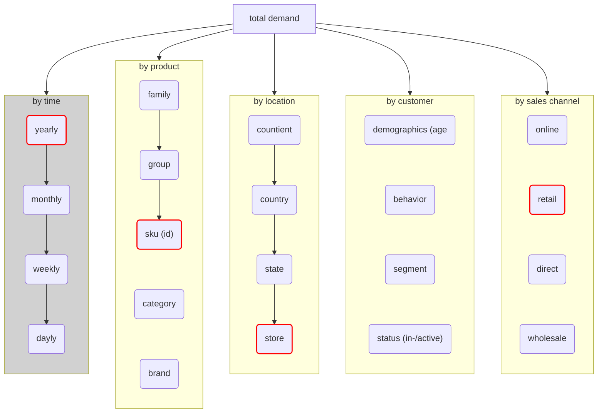

# Overview

| Dataset       | Source       | Frequency | Time Span | Target Variable | Granularity    |
|---------------|--------------|-----------|-----------|-----------------|----------------|
| Backery       | University   | Daily     | 2010–2022 | Sales (€)       | Category level |
| M5 (Walmart)	| Univ./Kaggle | Daily     | 2015–2021 | kWh             | Total          |
| Rossmann      | Kaggle	   | 	   |  |       |    |


# Datasets aussuchen

# Fragen:

## F1:Voregehen erst verscheidene muti und verschiedenen gewrappte single modelle implementieren für 2 datasets und wenn noch zeit für einen dritten dataset

## Datensätze:

- M5: 5 jahre - 3000 items - 10 stores - täglich
- Backery: 3 jahre - 3 items - 32 stores - täglich
- Ashrae (energy): 1 jahr (evtl. 2) - 1400 gebäude - 4 energie-typen - stündlich
- favorita: 3,5 jahre
- fashion: 2 jahre
- mClinica 

## F2: Idee:

### Variante A: drei datensätze aus dem einzelhandel (food) bereich, m5(only food) + backery + X
### Variante B: drei datensätze aus unterschiedlichen branchen reitail, engergeiverbrauch, (mClinica oder andere???)

#### 1. Einzelhandelsverkaufsdaten
**Eigenschaften**: Tägliche/wöchentliche Verkaufszahlen, saisonale Schwankungen, Promotions-Effekte.       
**Herausforderungen**: Saisonalitäten, kurzfristige Ereignisse, verrauschte Signale.        
**Prognoseziel**: Vorhersage der Verkaufszahlen (4-12 Wochen) zur Unterstützung von Bestandsentscheidungen.     
**ML-Ansätze**: Iterative Modelle (z. B. XGBoost), Multi-Step-Modelle (z. B. LSTM), Kombinationen mit statistischen Methoden (SARIMA).

m5(walmart: food, household, ...) > backery > favorita > predict futre sales

#### 2. Energieverbrauchsdaten
**Eigenschaften**: Stunden-/Tageswerte, beeinflusst durch Wetter, Wochentag, Feiertage.     
**Herausforderungen**: Saisonale und tageszeitabhängige Schwankungen, externe Faktoren, fehlende Werte.     
**Prognoseziel**: Vorhersage des Energieverbrauchs zur Unterstützung der Netzstabilität und Lastplanung.        
**ML-Ansätze**: Hybridmodelle mit externen Variablen (z. B. LSTM mit externen Inputs, Random Forests).  

A :https://www.kaggle.com/competitions/ashrae-energy-prediction/data        
B: https://www.kaggle.com/datasets/claytonmiller/buildingdatagenomeproject2     
A > B

#### 3. Produktions-/Logistik-Daten
**Eigenschaften**: Periodische Daten zu Beständen, Bestellungen und Lieferungen.        
**Herausforderungen**: Verzögerungen, variable Lieferzeiten, Abhängigkeiten in der Lieferkette.     
**Prognoseziel**: Mehrperiodenprognose zur Optimierung von Lagerhaltung und Produktionsplanung.     
**ML-Ansätze**: Bottom-up vs. Top-down Ansätze, Rekonsolidierung von Vorhersagen, Feature Engineering zur Modellierung der Lieferkette.     

# 4. Top-down, Bottom-up und Middle-out Ansätze
Die Wahl der Forecast-Reconciliation-Strategie – also, ob man einen top-down, bottom-up oder middle-out Ansatz wählt – kann einen wesentlichen Unterschied machen:


=== "Top-down:"

    Prognosen werden auf aggregierter Ebene erstellt und anschließend in die feineren Ebenen heruntergebrochen.

    **Vorteil**: Glattere Vorhersagen, da Aggregation Rauschen reduziert.

    **Nachteil**: Detailgenauigkeit kann leiden; Verteilungsregeln müssen festgelegt werden.

=== "Bottom-up:"
    Einzelne, feinkörnige Vorhersagen werden aggregiert.

    **Vorteil**: Detailtreue Vorhersagen, die lokale Besonderheiten erfassen.

    **Nachteil**: Kann durch hohe Varianz und Rauschen in den Daten anfällig für Fehler sein.

=== "Middle-out:"

    Eine Mischstrategie, bei der ein Mittelwertniveau prognostiziert und dann sowohl nach oben als auch nach unten rekonstruiert wird.

    **Vorteil**: Versucht, Vorteile beider Ansätze zu kombinieren, indem es etwa auf robustere aggregierte Daten und zugleich lokale Details setzt.
    Die Wahl hängt stark von der Datenstruktur, der Vorhersagegenauigkeit auf den jeweiligen Ebenen und den praktischen Anforderungen an die Forecast-Konsistenz ab. Reconciliation-Methoden (also Ansätze, um die verschiedenen Ebenen konsistent zu machen) sind oft notwendig, um sicherzustellen, dass etwaige Vorhersagen auf den unterschiedlichen Aggregationsstufen miteinander übereinstimmen.

## Idee:

### 1. Einzelhandelsverkaufsdaten
**Eigenschaften**: Tägliche/wöchentliche Verkaufszahlen, saisonale Schwankungen, Promotions-Effekte.       
**Herausforderungen**: Saisonalitäten, kurzfristige Ereignisse, verrauschte Signale.        
**Prognoseziel**: Vorhersage der Verkaufszahlen (4-12 Wochen) zur Unterstützung von Bestandsentscheidungen.     
**ML-Ansätze**: Iterative Modelle (z. B. XGBoost), Multi-Step-Modelle (z. B. LSTM), Kombinationen mit statistischen Methoden (SARIMA).

m5(walmart: food, household, ...) > backery > favorita > predict futre sales

### 2. Energieverbrauchsdaten
**Eigenschaften**: Stunden-/Tageswerte, beeinflusst durch Wetter, Wochentag, Feiertage.     
**Herausforderungen**: Saisonale und tageszeitabhängige Schwankungen, externe Faktoren, fehlende Werte.     
**Prognoseziel**: Vorhersage des Energieverbrauchs zur Unterstützung der Netzstabilität und Lastplanung.        
**ML-Ansätze**: Hybridmodelle mit externen Variablen (z. B. LSTM mit externen Inputs, Random Forests).  

A :https://www.kaggle.com/competitions/ashrae-energy-prediction/data        
B: https://www.kaggle.com/datasets/claytonmiller/buildingdatagenomeproject2     
A > B

### 3. Produktions-/Logistik-Daten
**Eigenschaften**: Periodische Daten zu Beständen, Bestellungen und Lieferungen.        
**Herausforderungen**: Verzögerungen, variable Lieferzeiten, Abhängigkeiten in der Lieferkette.     
**Prognoseziel**: Mehrperiodenprognose zur Optimierung von Lagerhaltung und Produktionsplanung.     
**ML-Ansätze**: Bottom-up vs. Top-down Ansätze, Rekonsolidierung von Vorhersagen, Feature Engineering zur Modellierung der Lieferkette.     

# Data Understanding

In this paper we concentrate ous on prediction sales for diffrent relailers. There are multipe dimension with diffrent aggregation levels. 
Dimension are for example:

- time
- product
- location (e.g. store, country)
- customer segments (e.g. age, loyalty)
- sales channel (e.g online, over a specific webside)
- ~~? promotions, seasonal events (e.g. Black Friday, X-Mass)~~


## (Flowchart)

```mermaid
flowchart

```

# Data Preprocessing

This section will cover the steps and techniques used for data preprocessing in the multi-period forecasting project.

## Introduction

Provide an overview of the importance of data preprocessing and its impact on the forecasting model.

## Steps

1. **Data Collection**: Describe the sources and methods used to collect the data.
2. **Data Cleaning**: Explain the techniques used to handle missing values, outliers, and inconsistencies.
3. **Data Transformation**: Detail the processes of normalization, scaling, and encoding.
4. **Feature Engineering**: Discuss the creation of new features and selection of relevant features.
5. **Data Splitting**: Outline how the data is divided into training, validation, and test sets.

## Conclusion

Summarize the key points and the importance of each preprocessing step in the context of the forecasting model.
