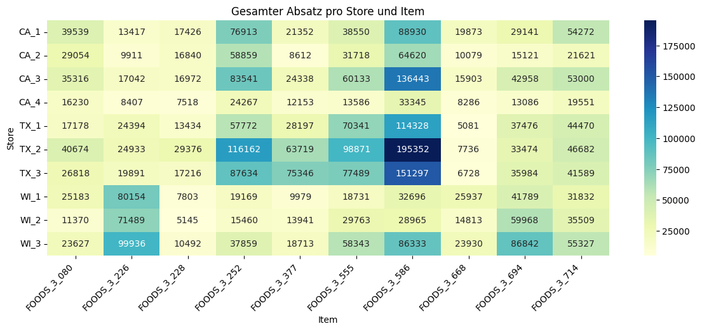
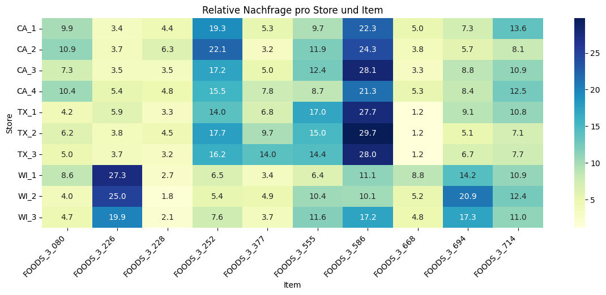
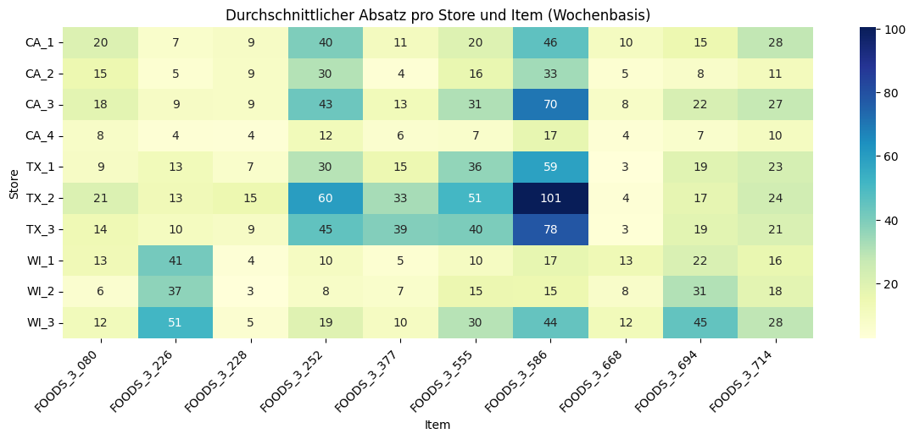

# Datenvorverarbeitung für M5 Daten (Walmart)

Diese Seite dokumentiert die **datensatz­spezifische** Analyse und Aufbereitung für den *M5*-Datensatz.

### **1. Datenerhebung**

Die Daten wurden vom Lehrstuhl für Logistik und Supply Chain bereitgestellt. Das Original stammt aus dem [Kaggle-Wettbewerb "M5 Forecasting - Accuracy"](https://www.kaggle.com/c/m5-forecasting-accuracy/).

### **2. Datenüberblick & Beschreibung**

- Dieser Datensatz enthält nur einen Auszug aus dem ursprünglichen Kaggle-Datensatz.
- Der Datensatz umfasst **interne** (z. B. State, Demand, ...) und **externe** (Events, SNAP-Day, ...) Daten.
- Zu beachten ist, dass viele der unten aufgeführten Spalten bereits vorverarbeitet sind, sodass einige Beispielwerte bereits skaliert oder kodiert wurden.
- Die Spalte "Ursprung" gibt an, ob eine Variable bereits im ursprünglichen Datensatz des Lehrstuhls enthalten war oder ob sie von mir im Rahmen der Vorverarbeitung ergänzt bzw. konstruiert wurde:
    - original: Die Variable war bereits im Ausgangsdatensatz enthalten und wurde ggf. von mir bereinigt oder korrigiert.
    - abgeleitet: Die Variable wurde von mir neu erzeugt – entweder durch Transformation bestehender Spalten oder durch Kombination bzw. Berechnung zusätzlicher Merkmale (Feature Engineering).

??? info "Datensatz Beschreibung"
    | Variable                                           | Datentyp | Beispiel             | Ursprung   | Transformation                            | Beschreibung                                              |
    | -------------------------------------------------- | -------: | -------------------- | ---------- | ----------------------------------------- | --------------------------------------------------------- |
    | dayIndex                                           |      int | 29                   | abgeleitet | aus `date`                                | Laufender Tagesindex (Start = erster Datentag).           |
    | date                                               | datetime | 2011-02-26           | original   | none                                      | Kalendertag (ISO-Datum).                                  |
    | is\_sporting\_event                                |      int | 0                    | original   | binary encoded                            | Sport-Event an diesem Tag: 1/0.                           |
    | is\_cultural\_event                                |      int | 0                    | original   | binary encoded                            | Kultur-Event an diesem Tag: 1/0.                          |
    | is\_national\_event                                |      int | 0                    | original   | binary encoded                            | Nationales Event an diesem Tag: 1/0.                      |
    | is\_religious\_event                               |      int | 0                    | original   | binary encoded                            | Religiöses Event an diesem Tag: 1/0.                      |
    | is\_snap\_day                                      |      int | 0                    | original   | binary encoded                            | SNAP-bezogener Tag: 1/0.                                  |
    | state\_XX                                          |      int | 1                    | original   | One-Hot                                   | Bundesstaat (XX ∈ {CA, TX, WI}). Pro Zeile genau eine 1.  |
    | weekday\_X                                         |      int | 0                    | original   | One-Hot                                   | Wochentag (X ∈ {MON,…,SUN}). Pro Zeile genau eine 1.      |
    | month\_X                                           |      int | 0                    | original   | One-Hot                                   | Monat (X ∈ {JAN,…,DEC}). Pro Zeile genau eine 1.          |
    | year\_YYYY                                         |      int | 0                    | original   | One-Hot                                   | Jahr (YYYY ∈ {2011,…,2016}). Pro Zeile genau eine 1.      |
    | item\_FOODS\_3\_ZZZ                                |      int | 1                    | original   | One-Hot                                   | Produkt-Dummy (konkrete Items wie 080, 226, …).           |
    | store\_SS\_N                                       |      int | 0                    | original   | One-Hot                                   | Store-Dummy, SS = Staat {CA,TX,WI}, N = Nummer.           |
    | label                                              |   object | train                | original   | none                                      | Kennzeichnung Train/Test.                                 |
    | scalingValue                                       |    float | 53.0                 | original   | none                                      | Maximalwert der Originalnachfrage je ID (für Skalierung). |
    | demand\_\_sum\_values\_X                           |    float | 2.90566              | abgeleitet | Rolling-Summe (X∈{7,14,28}), **scaled**   | Summe der skalierten Nachfrage über X Tage.               |
    | demand\_\_median\_X                                |    float | 0.396226             | abgeleitet | Rolling-Median, **scaled**                | Median der skalierten Nachfrage über X Tage.              |
    | demand\_\_mean\_X                                  |    float | 0.415094             | abgeleitet | Rolling-Mean, **scaled**                  | Gleitender Mittelwert über X Tage.                        |
    | demand\_\_standard\_deviation\_X                   |    float | 0.165104             | abgeleitet | Rolling-Std, **scaled**                   | Standardabweichung über X Tage.                           |
    | demand\_\_variance\_X                              |    float | 0.027259             | abgeleitet | Rolling-Var, **scaled**                   | Varianz über X Tage.                                      |
    | demand\_\_root\_mean\_square\_X                    |    float | 0.446724             | abgeleitet | Rolling-RMS, **scaled**                   | RMS der Nachfrage über X Tage.                            |
    | demand\_\_maximum\_X                               |    float | 0.735849             | abgeleitet | Rolling-Max, **scaled**                   | Maximalwert über X Tage.                                  |
    | demand\_\_absolute\_maximum\_X                     |    float | 0.735849             | abgeleitet | Rolling-Abs-Max, **scaled**               | Absolutes Maximum der Nachfrage.                          |
    | demand\_\_minimum\_X                               |    float | 0.226415             | abgeleitet | Rolling-Min, **scaled**                   | Minimalwert über X Tage.                                  |
    | demand                                             |    float | 0.679245             | abgeleitet | skaliert mit `scalingValue`               | Zielvariable (skaliert).                                  |
    | id                                                 |   object | CA\_1\_FOODS\_3\_080 | original   | none                                      | Kombinierter Schlüssel: Store + Item.                     |
    | demand\_original\_reconstructed                    |    float | 36.0                 | abgeleitet | `demand * scalingValue`                   | Rekonstruierter unge­skalierter Nachfragewert.            |
    | year                                               |      int | 2011                 | abgeleitet | aus `date`                                | Kalenderjahr.                                             |
    | yearMonth                                          |      str | 2011-02              | abgeleitet | zeitl. Aggregation (Monat)                | YYYY-MM für Visualisierung/Grouping.                      |
    | yearWeek                                           |  int/str | 8 / 2011-08          | abgeleitet | zeitl. Aggregation (ISO-Woche)            | Kalenderwoche bzw. YYYY-WW, je nach Implementierung.      |
    | item\_id                                           |      str | FOODS\_3\_080        | abgeleitet | aus `id`                                  | Item-Komponente aus ID.                                   |
    | store\_id                                          |      str | CA\_1                | abgeleitet | aus `id`                                  | Store-Komponente aus ID.                                  |
    | week                                               |      int | 8                    | abgeleitet | ISO-KW                                    | Kalenderwoche (1–53).                                     |
    | weekday                                            |      int | 5                    | abgeleitet | aus `date`                                | 0 = Montag, …, 6 = Sonntag.                               |
    | month                                              |      int | 2                    | abgeleitet | aus `date`                                | 1–12 (Jan–Dez).                                           |
    | year\_scaled                                       |      int | 0                    | abgeleitet | Min-Shift (2011→0, …)                     | Jahr auf 0-basierte Skala verschoben.                     |
    | dayofyear                                          |      int | 57                   | abgeleitet | aus `date`                                | Tag im Jahr (1–365/366).                                  |
    | dayofyear\_sin                                     |    float | 0.830797             | abgeleitet | zyklisch (sin)                            | Zyklische Kodierung von `dayofyear`.                      |
    | dayofyear\_cos                                     |    float | 0.556576             | abgeleitet | zyklisch (cos)                            | Zyklische Kodierung von `dayofyear`.                      |
    | weekday\_sin                                       |    float | −0.974928            | abgeleitet | zyklisch (sin)                            | Zyklische Kodierung von `weekday`.                        |
    | weekday\_cos                                       |    float | −0.222521            | abgeleitet | zyklisch (cos)                            | Zyklische Kodierung von `weekday`.                        |
    | month\_sin                                         |    float | 0.5                  | abgeleitet | zyklisch (sin)                            | Zyklische Kodierung von `month`.                          |
    | month\_cos                                         |    float | 0.866025             | abgeleitet | zyklisch (cos)                            | Zyklische Kodierung von `month`.                          |
    | demand\_lag\_X                                     |    float | 0.377358             | abgeleitet | Lag X∈{1,7,14,28}                         | Nachfragewert vor X Tagen.                                |
    | demand\_lag\_X\_was\_nan                           |      int | 0/1                  | abgeleitet | binary encoded                            | 1, falls Lag am Serienanfang fehlte/ersetzt wurde.        |
    | demand\_diff\_X                                    |    float | 0.000000             | abgeleitet | Differenz zu Lag                          | `demand - demand_lag_X`.                                  |
    | demand\_diff\_X\_was\_nan                          |      int | 0/1                  | abgeleitet | binary encoded                            | 1, falls Diff-Basis fehlte (z. B. Serienstart).           |
    | demand\_rolling\_mean\_7                           |    float | 0.679245             | abgeleitet | glättend                                  | 7-Tage-Mittel (pro Item/Store).                           |
    | demand\_ratio\_to\_7\_avg                          |    float | 0.999985             | abgeleitet | normierend                                | `demand / rolling_mean_7`.                                |
    | demand\_rolling\_mean\_28                          |    float | 0.679245             | abgeleitet | glättend                                  | 28-Tage-Mittel (pro Item/Store).                          |
    | demand\_ratio\_to\_28\_avg                         |    float | 0.999985             | abgeleitet | normierend                                | `demand / rolling_mean_28`.                               |
    | demand\_rolling\_mean\_7\_lag\_Y                   |    float | 0.68                 | abgeleitet | Lag Y∈{1,7}                               | Verzögerte 7-Tage-Mittel.                                 |
    | demand\_rolling\_mean\_7\_lag\_Y\_was\_nan         |      int | 0/1                  | abgeleitet | binary encoded                            | 1, falls Wert imputiert wurde.                            |
    | demand\_rolling\_mean\_28\_lag\_Y                  |    float | 0.68                 | abgeleitet | Lag Y∈{1,7}                               | Verzögerte 28-Tage-Mittel.                                |
    | demand\_rolling\_mean\_28\_lag\_Y\_was\_nan        |      int | 0/1                  | abgeleitet | binary encoded                            | 1, falls Wert imputiert wurde.                            |
    | demand\_ratio\_to\_7\_avg\_lag\_Y                  |    float | 1.01                 | abgeleitet | Lag Y∈{1,7}                               | Verzögertes Verhältnis zu 7-Tage-Mittel.                  |
    | demand\_ratio\_to\_7\_avg\_lag\_Y\_was\_nan        |      int | 0/1                  | abgeleitet | binary encoded                            | 1, falls Wert imputiert wurde.                            |
    | demand\_ratio\_to\_28\_avg\_lag\_Y                 |    float | 0.98                 | abgeleitet | Lag Y∈{1,7}                               | Verzögertes Verhältnis zu 28-Tage-Mittel.                 |
    | demand\_ratio\_to\_28\_avg\_lag\_Y\_was\_nan       |      int | 0/1                  | abgeleitet | binary encoded                            | 1, falls Wert imputiert wurde.                            |
    | demand\_\_standard\_deviation\_X\_lag\_Y           |    float | 0.16                 | abgeleitet | Rolling-Std (X∈{7,14,28}) mit Lag Y∈{1,7} | Verzögerte Std.-Abw. der Nachfragefenster.                |
    | demand\_\_standard\_deviation\_X\_lag\_Y\_was\_nan |      int | 0/1                  | abgeleitet | binary encoded                            | 1, falls Wert imputiert wurde.                            |
    | demand\_\_maximum\_X\_lag\_Y                       |    float | 0.74                 | abgeleitet | Rolling-Max (X∈{7,14,28}) mit Lag Y∈{1,7} | Verzögerte Maxima der Nachfragefenster.                   |
    | demand\_\_maximum\_X\_lag\_Y\_was\_nan             |      int | 0/1                  | abgeleitet | binary encoded                            | 1, falls Wert imputiert wurde.                            |

    Hinweise & Konventionen:  
    
    - Platzhalter: X für Fenstergrößen {7, 14, 28}; Y für Lags {1, 7}.
    - Skalierung: Alle als scaled markierten Demand-Aggregationen beziehen sich auf die skalierten demand-Werte (Skalierung per scalingValue).
    - One-Hot-Familien:
      - state_XX (CA, TX, WI), weekday_X (MON–SUN), month_X (JAN–DEC), year_YYYY (2011–2016)
      - item_FOODS_3_ZZZ (konkrete Food-Items)
      - store_SS_N (z. B. store_CA_1, store_TX_3, …)
    - _was_nan-Flags: Markieren, dass das korrespondierende Feature am Rand der Zeitserie fehlte und imputiert/verschoben wurde.
    - yearWeek: Falls du sowohl numerische ISO-KW als auch eine zusammengesetzte Darstellung brauchst, halte die Spalte konsistent (z. B. nur YYYY-WW als String).


??? warning "Inkonsistenz bei Scaling Value"
    Die Spalte `scalingValue` wurde für jede Produkt-Store-Kombination (`id`) als **Maximalwert der ursprünglichen Nachfrage** (`demand_original_reconstructed`) berechnet.

    Die ursprünglichen Nachfragewerte wurden anschließend durch Division durch den jeweiligen `scalingValue` normalisiert, sodass die skalierte Spalte `demand` Werte im Bereich von 0 bis 1,19 annimmt.
    Es sei jedoch angemerkt, dass dies nicht immer zutrifft, da in fünf Fällen der `scalingValue` **nicht** mit dem tatsächlichen Maximalwert von `demand_original_reconstructed` übereinstimmt!


### **3. Data Cleaning**
In this step, the dataset was examined for missing values, duplicates, inconsistencies, and outliers, and cleaned if necessary.

- No missing values were found in the original dataset.
- No duplicate rows were detected.
- No inconsistencies were observed in variable formats or values.
- Outliers were examined using boxplots for all relevant numerical variables. Note: many of these variables are already scaled, which affects the visual range of the outliers.

<!--
!!! info "Boxplots"
    
    === "Teil 1"
        ```plotly
        {"file_path": "assets/json/m5/m5_boxplot_multiple_part_1.json"}
        ```

    === "Teil 2"
        ```plotly
        {"file_path": "assets/json/m5/m5_boxplot_multiple_part_2.json"}
        ```
-->

### **4. Exploratory Data Analysis (EDA)**
Visualisierung der Nachfrageentwicklung auf unterschiedlichen zeitlichen Aggregationsebenen (z. B. täglich, wöchentlich, pro Store oder Item).

!!! info "Total Demand = Tägliche Gesamtnachfrage"
    === "Per Day"
        ```plotly
        {"file_path": "./assets/json/m5/totalDemand/m5_total_demand_day.json"}
        ```

        Die **IQR-Methode** (Interquartilsabstand) identifiziert Ausreißer als Werte, die außerhalb des Bereichs von

        * $Q1 − 1.5 × IQR$
        * $Q3 + 1.5 × IQR$

        liegen. Wobei $Q1$ das erste Quartil, $Q3$ das dritte Quartil und $IQR = Q3 − Q1$ der Interquartilsabstand ist.

        Alle Ausreißer mit Nachfrage = 0 sind Feiertage.

    === "Per Week"
        ```plotly
        {"file_path": "./assets/json/m5/totalDemand/m5_total_demand_week.json"}
        ```

    === "Per Month"
        ```plotly
        {"file_path": "./assets/json/m5/totalDemand/m5_total_demand_month.json"}
        ```

    === "Per Year"
        ```plotly
        {"file_path": "./assets/json/m5/totalDemand/m5_total_demand_year.json"}
        ```

??? info "Demand per Item = Nachfrageverlauf pro Produkt"
    
    ```plotly
    {"file_path": "./assets/json/m5/perItem/m5_demand_per_item_per_yearWeek.json"}
    ```

??? info "Demand per Store = Nachfrageverlauf pro Laden"
    
    ```plotly
    {"file_path": "./assets/json/m5/perStore/m5_demand_per_store_per_yearWeek.json"}
    ```

??? info "Demand per State"

    === "per Day"
        ```plotly
        {"file_path": "./assets/json/m5/perState/m5_demand_per_state_day.json"}
        ```
    === "per Week (sum)"
        ```plotly
        {"file_path": "./assets/json/m5/perState/m5_demand_per_state_yearWeek.json"}
        ```

??? info "Demand per Store-Item-Combi = Nachfrageverlauf pro Produkt-Laden-Kombination"
    
    ```plotly
    {"file_path": "./assets/json/m5/perItemStore/m5_demand_per_store_item_week.json"}
    ```

#### Store- und Produktbezogene Nachfragevergleich
Analyse der relativen und absoluten Nachfragemuster je Store und Produkt – geeignet zur Identifikation von Verkaufsschwerpunkten und Sortimentsstrategien.

!!! info "Heatmaps"
    === "Kumulierte Gesamtnachfrage"
        Zeigt den kumulierten (totalen) Absatz je Item für jeden Store über den gesamten Zeitraum – nützlich, um starke vs. schwache Verkaufsstellen zu erkennen.
        
    
        __📊 Kumulierte Gesamtnachfrage je Store und Produkt__

        Die folgende Heatmap visualisiert die kumulierte Gesamtnachfrage von zehn verschiedenen Lebensmitteln (Items) über den gesamten Verkaufszeitraum hinweg – aufgeschlüsselt nach Store. Insgesamt umfasst die Analyse zehn Stores, die sich auf die drei US-Bundesstaaten Kalifornien (CA), Texas (TX) und Wisconsin (WI) verteilen.

        Ziel dieser Darstellung ist es, mengenmäßig starke vs. schwache Verkaufsstellen zu identifizieren sowie regionale Unterschiede im Nachfrageverhalten auf Produktebene sichtbar zu machen.

        __💡 Interpretation der Heatmap__
        
        - Große Unterschiede zwischen Bundesstaaten und Stores:
            
            Stores in Kalifornien (z. B. CA_3 mit FOODS_3_586 = 136.443) und Texas (z. B. TX_2 mit FOODS_3_586 = 195.352) zeigen teils sehr hohe kumulierte Absätze einzelner Artikel. Dies deutet auf größere Filialen oder generell höhere Nachfragen in diesen Regionen hin.

        - Besonders stark nachgefragte Produkte:
            
            Das Produkt FOODS_3_586 (möglicherweise ein Grundnahrungsmittel oder häufig promoteter Artikel) verzeichnet in fast allen Stores sehr hohe Verkaufszahlen. In mehreren Stores (z. B. CA_3, TX_2, TX_3) überschreiten die kumulierten Verkäufe die Marke von 100.000 Einheiten.

        - Regionale Produktaffinitäten:
            
            In Wisconsin fällt auf, dass z. B. FOODS_3_226 außergewöhnlich hohe Werte erreicht (z. B. WI_3 = 99.936), während der Absatz dieses Produkts in Kalifornien relativ niedrig ist (z. B. CA_4 = 8.407). Dies deutet auf regionale Unterschiede in der Produktpräferenz oder Sortimentsgestaltung hin.

        - Schwache Stores / Nischenprodukte:
            
            Einige Stores wie CA_4 zeigen durchweg geringere Absatzmengen über die meisten Produkte hinweg, was auf kleinere Märkte oder begrenzte Kundenreichweite hinweisen könnte.
            
            Auch Produkte wie FOODS_3_228 und FOODS_3_252 weisen in bestimmten Stores nur niedrige kumulierte Werte auf, was auf geringere Relevanz oder eingeschränkte Verfügbarkeit schließen lässt.

        __🧭 Fazit__
        
        Die Heatmap bietet eine kompakte und zugleich tiefgehende Übersicht über die Nachfrageverteilung im M5-Datensatz. Sie erlaubt es:
        
        - Absatzstarke Kombinationen aus Store und Produkt zu erkennen,
        - potenzielle Fokusprodukte für Prognosemodelle auszuwählen,
        - sowie regionale Besonderheiten in der Nachfrage besser zu verstehen.

        Diese Erkenntnisse sind besonders wertvoll für eine gezielte Modellierung und Optimierung von Forecasting-Modellen auf Store- oder Produktebene.

    === "Relative Nachfrageanteile"

        Stellt die prozentuale Verteilung der Nachfrage je Item innerhalb jedes Stores dar – gut geeignet, um item-spezifische Präferenzen pro Store zu identifizieren.      
        

        __📊 Relative Nachfrageanteile je Produkt innerhalb jedes Stores__

        Diese Heatmap stellt die prozentuale Verteilung der Nachfrage je Item innerhalb jedes Stores dar. Für jeden Store ergeben die Werte 100 %, sodass ersichtlich wird, welche Produkte relativ am meisten oder am wenigsten nachgefragt wurden – unabhängig von der absoluten Verkaufshöhe.

        Ziel dieser Darstellung ist es, produktbezogene Präferenzen innerhalb jedes Stores zu identifizieren und regionale Muster im Kundenverhalten zu erkennen.

        __💡 Interpretation der Heatmap__

        - Item FOODS_3_586 dominiert in nahezu allen Stores:
  
            In allen drei Bundesstaaten zeigt sich eine überdurchschnittlich hohe relative Nachfrage für FOODS_3_586, z. B. in TX_2 mit 29,73 %, TX_1 mit 27,70 %, und CA_3 mit 28,10 %. Dies deutet auf eine starke Kundenpräferenz für dieses Produkt hin – unabhängig vom Store.

        - Store-spezifische Produktschwerpunkte:
            - WI_1 und WI_2 weisen außergewöhnlich hohe relative Nachfrageanteile für FOODS_3_226 auf (27,33 % bzw. 24,96 %). In den meisten anderen Stores liegt dieser Wert nur zwischen 3–6 %.
  
                → Dies könnte auf regionale Vorlieben, lokale Promotionen oder ein besonders gut platziertes Sortiment hindeuten.

            - TX_3 zeigt mit 13,95 % auch eine sehr hohe relative Nachfrage für FOODS_3_377, was sonst eher niedrig ausfällt.

        - Gering geschätzte Produkte:
         
            - Produkte wie FOODS_3_228, FOODS_3_668 oder FOODS_3_080 erreichen in vielen Stores nur einen geringen relativen Anteil. Z. B. liegt FOODS_3_668 in TX_2 bei nur 1,18 %, in TX_1 sogar bei 1,23 %.
                
                → Solche Produkte spielen eine untergeordnete Rolle im Store-spezifischen Sortiment oder haben ein eingeschränktes Kundeninteresse.

        - Regionale Unterschiede bei FOODS_3_714 und FOODS_3_694:
  
            Während diese Items in Wisconsin-Stores teils über 17 % (FOODS_3_694 in WI_3) erreichen, bleiben sie in Kalifornien und Texas meist unter 10 %. Dies verdeutlicht die regionale Variation in Konsumgewohnheiten.

        __🧭 Fazit__

        Diese Heatmap bietet einen wichtigen komplementären Blick zur kumulierten Gesamtnachfrage:
        
        - Sie normalisiert die Daten pro Store und erlaubt daher ein besseres Verständnis für interne Produktschwerpunkte.
        - Deutlich werden Store- und Region-spezifische Vorlieben, die für Sortimentsoptimierung, Targeted Promotions oder Store-Clustering genutzt werden können.
        - In Kombination mit den absoluten Verkaufszahlen lässt sich präzise bestimmen, ob ein Produkt sowohl häufig verkauft wurde, als auch einen hohen Anteil am Gesamtverkauf eines Stores hatte – oder ob es nur in einzelnen Märkten punktuell gefragt war.

    === "Durchschnittlicher Wochenabsatz"
        Zeigt den durchschnittlichen Wochenabsatz je Item und Store – wichtig zur Glättung von Ausreißern und zur Erkennung regelmäßiger Verkaufsstärke.
        

        __📈 Durchschnittlicher Wochenabsatz je Produkt und Store__
        
        Diese Heatmap zeigt den durchschnittlichen wöchentlichen Absatz je Produkt in jedem Store. Im Gegensatz zur kumulierten Nachfrage werden hier Ausreißer geglättet, wodurch ein besseres Bild der kontinuierlichen Verkaufsstärke entsteht. Sie erlaubt eine zeitlich normalisierte Bewertung, die besonders für Prognosemodelle, Bestandsplanung und Sortimentsentscheidungen relevant ist.

        __💡 Interpretation der Heatmap__
        
        - FOODS_3_586 ist durchgängig das stärkste Produkt über alle Stores hinweg:
            
            - Besonders hohe wöchentliche Absätze sind in TX_2 (100,60), TX_3 (78,02) und CA_3 (70,23) zu beobachten.
            
                → Diese Kontinuität bestätigt die Beobachtungen aus den vorherigen Heatmaps (kumuliert und relativ) und unterstreicht die robuste Nachfrage.

        - Starke Wochenperformance auch bei FOODS_3_252 in vielen Stores:

            - CA_3 (43,02), TX_2 (59,81) und TX_3 (45,20) zeigen, dass FOODS_3_252 zu den regelmäßig stark laufenden Artikeln gehört.

            - Auch in Kalifornien fällt die durchgängig solide Leistung dieses Produkts auf.

        - Regionale Spitzenreiter – besonders in Wisconsin:

            - WI_3 weist mit 51,45 (FOODS_3_226), 44,74 (FOODS_3_586) und 44,74 (FOODS_3_694) die höchsten wöchentlichen Absatzwerte über alle Stores hinweg auf.

            - Auch WI_2 und WI_1 zeigen sehr gute Werte bei FOODS_3_226.
            
                → Diese Artikel könnten in Wisconsin besonders stark verankert sein, was auf regionale Präferenzen oder spezielle Store-Konzepte hinweist.

        - Geringe wöchentliche Nachfrage in CA_4:

            - Alle Items liegen deutlich unter den Werten anderer Stores. Z. B. FOODS_3_586 mit nur 17,13, während andere Stores oft über 40 liegen.
                
                → CA_4 scheint im Vergleich eine schwächere Verkaufsdynamik zu haben – entweder aufgrund geringerer Besucherzahlen, kleinerer Verkaufsfläche oder lokaler Nachfragebesonderheiten.

        - Auffällige Varianz bei FOODS_3_226:

            - Extrem starke Nachfrage in Wisconsin (bis zu 51,45 in WI_3), aber nur 3–12 Einheiten pro Woche in allen anderen Regionen.
                
                → Dies untermauert die Erkenntnis aus der Heatmap zu relativen Anteilen: FOODS_3_226 ist ein klarer regionaler Top-Seller in Wisconsin.

        __🧭 Fazit__
        
        Die Betrachtung des durchschnittlichen Wochenabsatzes ermöglicht:

        - Stabilitätsanalysen über die Zeit – unabhängig von Saisonspitzen oder Ausreißern.
        - Identifikation von regelmäßig starken Artikeln zur besseren Planung von Lagerbeständen.
        - Vergleich der Store-Leistungsfähigkeit unter Normalbedingungen, z. B. durch das Erkennen schwächer performender Standorte (wie CA_4).
        - Bestätigung regionaler Produktstärken, wie bei FOODS_3_226 in Wisconsin oder FOODS_3_586 in fast allen Bundesstaaten.

## Datenqualität & EDA (Kernerkenntnisse)

- **Fehl-/Nullwerte & Dubletten:** geprüft; keine systematischen Probleme. **Extremwerte** (Feiertage, Events) werden als **plausibel** interpretiert.  
- **Zeitmuster:** deutliche **Feiertagspeaks** (u. a. Thanksgiving, Weihnachten), **ausgeprägtere Saisonalität** als Bakery, leichter **Abwärtstrend**.  
- **Heterogenität:** klare Produkt- und **Regionalunterschiede** (CA/TX/WI); Produkt-Rangfolgen variieren nach Staat/Store.

---

### 5. Preprocessing

#### Skalierung & Rückskalierung
- Pro Serie existiert `scalingValue`; Zielgröße `demand` ist **vor-skaliert** (`demand = original / scalingValue`).  
- Rückskalierung für Plots via `demand_original_reconstructed = demand × scalingValue`; **geringe Rundungsdifferenzen** in wenigen Fällen.

#### Zeit-/Kalender-/Event-Codierung
- Neben den Standard-Zeitfeldern werden **zyklische Encodings** (`weekday_sin/cos`, `month_sin/cos`, `dayofyear_sin/cos`) und Hilfsvariablen (`dayofyear`, `year_scaled`) verwendet.  
- **Events & SNAP** als binäre Indikatoren; **States** als One-Hot `state_CA/TX/WI`.

#### Feature Engineering (kausal)
- **Lags & Diffs:** `demand_lag_{1,7,14,28}`, `demand_diff_{1,7,14,28}`; ursprüngliche NaNs via `*_was_nan` markiert; **Forward-Fill je id**; **Burn-in**: erste `MAX_LAG` Zeilen entfernt.  
- **Rollierende Statistiken:** u. a. `demand_rolling_mean_{7,28}` und **Verhältnismaße** `demand_ratio_to_{7,28}_avg`; strikt **kausal** mit `min_periods=1`.  
- **Gelaggte Kovariaten:** ausgewählte abgeleitete Größen sowie **Event/SNAP** um `{1,7}` Tage gelaggt; NaN-Flags erhalten.  
- **Kategorische Encodings:** One-Hot für Items/Stores; zusätzlich **`state_XX`**.

#### Reproduzierbarkeit: 
Alle Transformationen deterministisch **pro `id`** und strikt **zeitkausal**; NaN-Ersatz explizit markiert (`*_was_nan`). Bereitgestellte Skalierungen wurden **nicht** rekalibriert.

